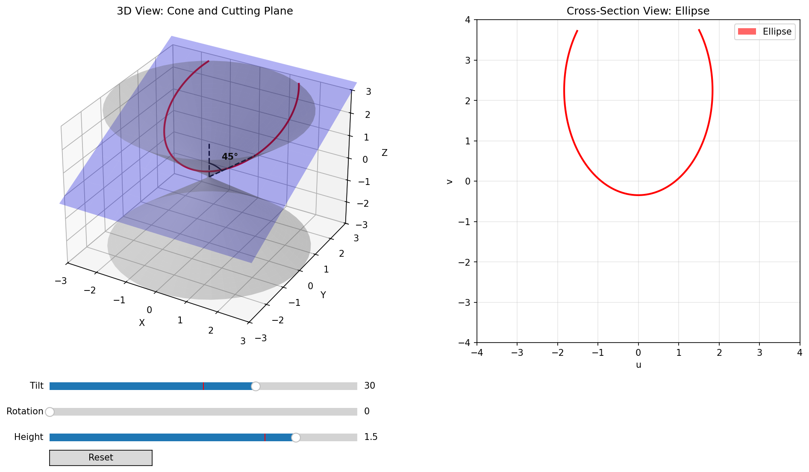

# Conic Sections Visualization

[](https://github.com/rtfisher/conic_sections_visualization/actions/workflows/tests.yml)



An interactive educational tool demonstrating how conic sections (circles, ellipses, parabolas, and hyperbolas) arise as cross-sections of a double cone.

## Overview

This visualization helps students understand the geometric origin of conic sections by showing:

1. **3D View**: A double cone with an adjustable cutting plane
2. **2D View**: The resulting conic section projected onto the cutting plane

## Installation

```bash
pip install numpy matplotlib
```

## Usage

```bash
python conic_sections.py
```

### Controls

- **Tilt** (-89 to 89 degrees): Angle of the cutting plane relative to horizontal
- **Rotation** (0 to 360 degrees): Rotation of the plane around the vertical axis
- **Height** (-2.5 to 2.5): Vertical position of the cutting plane
- **Reset**: Return all sliders to default values

### Conic Types

The type of conic section depends on the plane's tilt angle relative to the cone's half-angle (45 degrees):

| Tilt Angle | Conic Section |
|------------|---------------|
| 0 degrees | Circle |
| < 45 degrees | Ellipse |
| = 45 degrees | Parabola |
| > 45 degrees | Hyperbola |

## Course Context

Developed for beginning astronomy students to illustrate orbital mechanics, where different conic sections correspond to different orbital types based on total energy.

## Author

Robert Fisher
